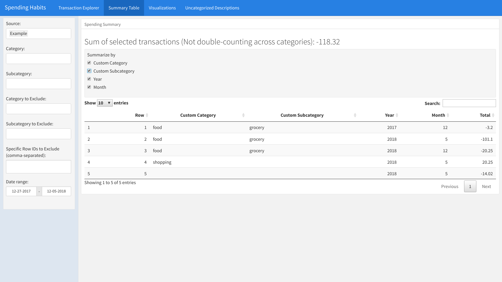
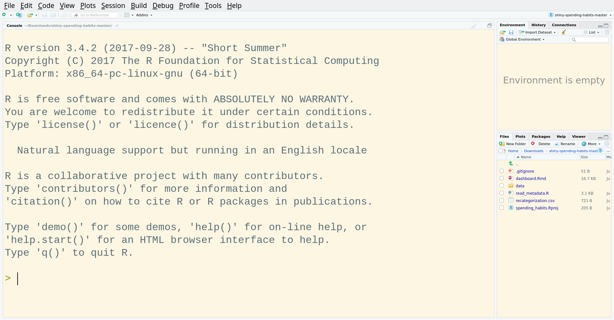

# Shiny Spending Habits

Analyze your spending habits, using R and Shiny, without sharing your spending with advertisers.

## Rationale

I recently signed up for [Mint.com](https://mint.com), a service from Intuit that analyzes users' spending trends. Unfortunately, I was underwhelmed by Mint's data analysis features. As a data scientist, I figured that I could write something similar, that didn't require me additionally selling my spending data to advertisers.

## Features and Screenshots

The app includes the following features:

- A transactions explorer, which is searchable and filterable by categories, subcategories, and date ranges.

Categories and subcategories are defined using search terms. The app then auto-categorizes each transaction. **Transactions are able to have more than one category and/or subcategory!**

- Clicking on rows displays the sum of transactions, at the top of the window. Transactions with multiple categories are not double-counted in this sum.

- A summary table, allowing seeing total spending by category, subcategory, year, and/or month.

- As with the transactions table, clicking on rows in the summary table tab displays the sum of transactions, at the top of the window. Transactions are not double-counted across categories or subcategories in this sum!

A variety of configurable visualizations, showing total spending in a time period, and spending over time, either overall or by category and/or subcategory.

## Installation

This app uses R, a free, open-source language for doing data analyses. Thus, to use this app, you'll need to install R. You'll also need to install RStudio, which gives R a nicer interface.

For each of the below pages, click the link for your operating system -- whether Windows, Mac OSX, or Linux:

- [Install R](https://cran.cnr.berkeley.edu/)
- [Install RStudio](https://www.rstudio.com/products/rstudio/download/#download)

## Security

This app **does not send your banking data anywhere. Your data stays on your computer. That's the entire point of this -- everything happens on your computer, so that you don't need to give access to your spending habits to advertising services like Mint.

## Use

### Instructions

To use this app, you'll need to do the following steps:

1. Download this app.
1. Download your credit card / bank statements from your credit card / bank website(s), in CSV (spreadsheet) format.
1. Put your credit card / bank statements into the `data` folder.
    1. Within the `data` folder is a directory called `example`. Make a copy of the `example` directory, and name it according to your financial institution (for example, `Capital One credit card`).
    1. Put your downloaded transaction CSVs from that institution into the folder. The app will automatically remove duplicates.
    1. Open `metadata.yaml`. This is the configuration file for that provider.
        1. Edit the lines in `metadata.yaml`:
            1. `source_title` is the name you want the source to be listed as in the app.
            1. `description_column_name` is the name of the column in the spreadsheet that includes the description of each transaction. This is the column that will be searched to categorize the transactions.
            1. `date_column` is the name of the column in the spreadsheet that includes the date of each transaction.
            1. `date_format` is the format of the dates in the `date_column` column. This helps the app know whether it's looking at dates in '06/13/18' format, '13/06/18' format, '2018-06-13' format, or some other format.
            1. `debit_column` and `credit_column`:
                1. `debit_column` is the the name of the column in the spreadsheet that includes transactions that were deducted from your account. It does *not* mean debit vs. credit card.
                1. Similarly, `credit_column` is the the name of the column (if there is one) in the spreadsheet that includes transactions that were credited / refunded to your account. It does *not* mean debit vs. credit card.
                1. If there is only one column for transaction amounts, you can set `debit_column` and `credit_column` to both have the same column name.  
                1. In any case, debit transactions are expected to be negative numbers; credit transactions are expected to be positive numbers.
1. Open `dashboard.Rmd` in RStudio.
1. Click the `Run Document` button.

#### Download this app:

#### Download your credit card / bank statements from your credit card / bank website(s):

#### Put your credit card / bank statements into the `data` folder:

#### Open `dashboard.Rmd` in RStudio:

#### Click the `Run Document` button:

## Author and current maintainer

This repository was written by, and is currently maintained by, [Jacob Levernier](https://adunumdatum.org) (<j@adunumdatum.org>).

## Conditions of use

### Social conditions

If you are a using this code, please get in touch and let me know how it works! This isn't a requirement, just something I'd like! :thumbsup: :pray:

### Legal conditions

Please see the `LICENSE.md` file for license information (i.e., the conditions under which you may reuse this app). The app is released under a ["BSD 3-Clause License"](https://tldrlegal.com/license/bsd-3-clause-license-(revised) "TLDR Legal: 'BSD 3-Clause License (Revised)'"). In summary, this means that I have released this app for others to use freely. I would appreciate you making changes you make to the code available to the community (preferably through this repository). As above, though, that's not a requirement here.

If you would like to arrange a different license, please contact Jacob Levernier at <j@adunumdatum.org>.

## Contributing

I welcome contributions!

**I also welcome contributions concerning documentation** -- if there are things that you had to work to understand (for example, how to even download these files in the first place), I welcome additional text for a Wiki that I can attach to this repository.

If you would like to contribute to this repository, please follow these steps:

1. If you feel comfortable using Git:
    1. Make a fork of this repository (from this repository's page on GitHub, click "Fork").
    1. Create a single commit that contains all of the changes that you would like to share (either by "squashing" your commits (see [here](http://stackoverflow.com/a/5189600 'StackOverflow: Squash my last X commits together using Git'), for example), or by just copying your altered files into a fresh copy of this repository).
    1. Make a pull request through GitHub (from your copy of the repository in GitHub, click "New Pull Request").
1. If you do not feel comfortable using Git: Send an email to the current repository maintainer listed [above](#current-maintainer 'Current maintainer'); I will work together with you to get your changes incorporated, and will add you to a list of contributors in this Readme.

